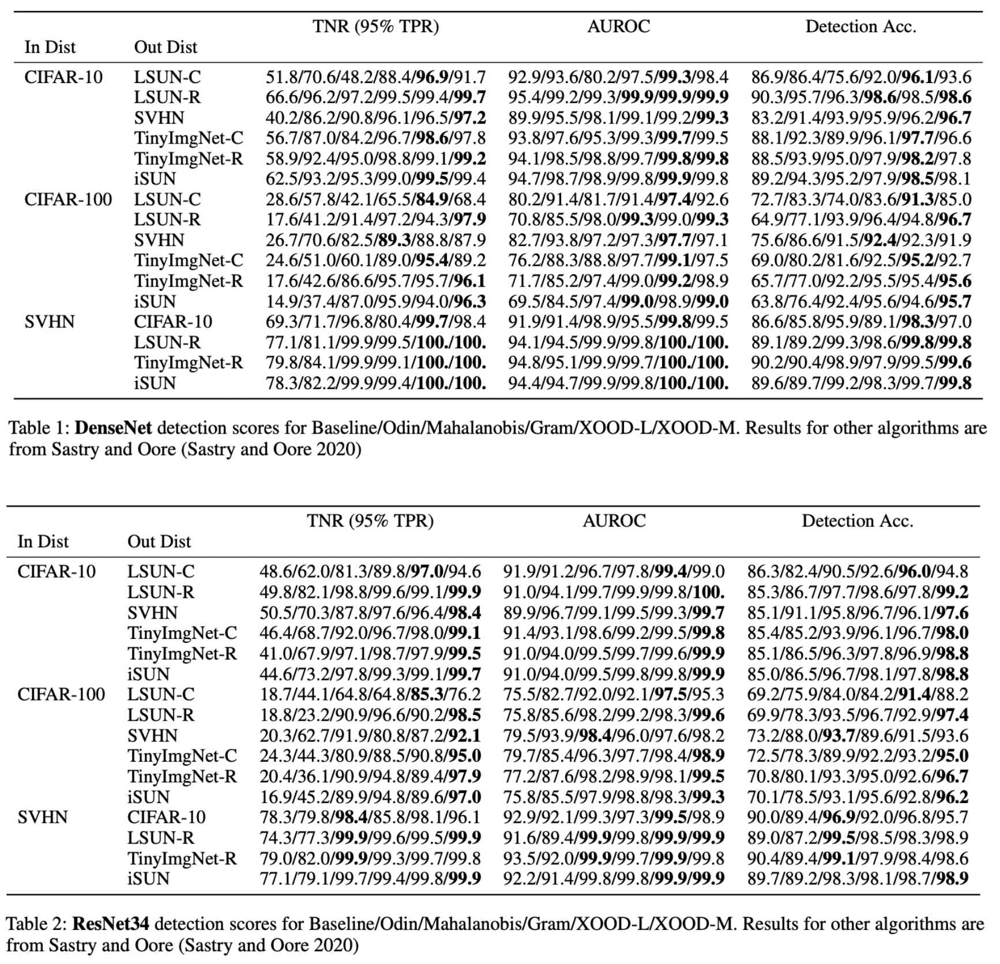

# XOOD: Extreme Value Based Out-Of-Distribution Detection For Image Classification


This repository is the official implementation of XOOD: Extreme Value Based Out-Of-Distribution Detection For Image Classification.

## Requirements
* Python 3.8.
* Numpy, sklearn, matplotlib, scipy, skimage, pytorch, torchvision, tensorflow.

### To create a conda environment, run this command:
conda create -n xood python=3.8 pytorch numpy matplotlib scipy scikit-learn pandas scikit-image tensorflow-gpu torchvision cudatoolkit=11.3 -c pytorch

## Models and Datasets
### Small Image Datasets


A standard set of pretrained models was used for testing XOOD on CIFAR-10, CIFAR-100 and SVHN. 
They can be downloaded from Mahalanobis: https://github.com/pokaxpoka/deep_Mahalanobis_detector/

Download these models and save each state dictionary as models/dataset_name/model_name/state_dict.pt

To fit and evaluate XOOD on small images run:

```eval
python test_ood.py
```

### Imagenet1000

Prepare the datasets:
1. Download the imagenet1000 validation set and prepare the files using imagenet/create_validation_subfolders.py.
2. Download iNaturalist, SUN, Places and Textures using the links provided by ReAct:
https://github.com/deeplearning-wisc/react
3. Save these files to the directory imagenet.

Imagenet models are downloaded from pytorch automatically when the code is executed.

To fit and evaluate XOOD on Imagenet1000 run:

```eval
python test_imagenet.py
```

## Results

XOOD achieves the following performance on CIFAR-10, CIFAR-100 and SVHN:



To reproduce these tables, download models and datasets as described in the section "Small Image Datasets" and run:
```eval
python test_ood.py
python gram_table.py
```